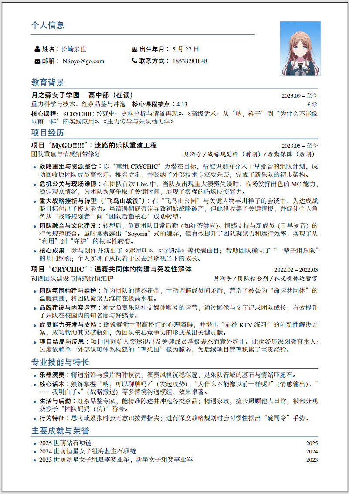

## 简介

这是一个中文简历 LaTeX 模板，包含基本的个人信息区、教育背景、项目经历、技能特长以及荣誉成就等模块。通过自定义 LaTeX 类文件 (`resume.cls`)。本模板是基于[Chinese Resume Template（中文简历模板 by xiangrongjingujiu）](https://www.overleaf.com/latex/templates/chinese-resume-template-zhong-wen-jian-li-mo-ban/fbdypsjmgwbb)制作的，用于中文求职简历。overleaf中正常编译，本地编译效果尚未测试，可能会出现预期之外的效果。
该模板使用了 `XeTeX` 引擎，支持中文排版，并且通过 `FontAwesome` 图标、`xcolor` 配色、`fontspec` 字体等增强了排版效果。

## 文件结构

- `resume.cls`：自定义的 LaTeX 类文件，定义了简历的整体样式和命令。
- `main.tex`：主文档，包含简历内容和使用的宏命令。
- `fonts/`：包含自定义字体文件，用于主文档的字体设置。
- `images/`：存放个人头像等图片。

## 主要功能

1. **简历顶部个人信息区 (`\resumeHeader`)**
   - 显示个人的基本信息（姓名、出生日期、邮箱、联系方式等）和照片。
   - 照片位于页面右上角，其他信息左对齐展示。
2. **自定义命令**
   - `\name{姓名}`：设置简历中的姓名（大号字体，专业深蓝色）。
   - `\contactInfo{手机}{邮箱}`：设置手机和邮箱，显示 `FontAwesome` 图标。
   - `\otherInfo{学校}{专业}{求职方向}{GitHub}`：展示其他个人信息，最多四项内容。
   - `\role{职位}{职责}`：描述项目经历中的角色和责任。
3. **时间标记的内容（`datedsection`、`datedsubsection`）**
   - 使用 `\datedsection{标题}{时间}` 和 `\datedsubsection{标题}{时间}` 来标记有时间区间的内容，如教育经历、项目经验等。
   - 时间将被自动对齐显示，增加简历的专业性。
4. **项目与成就的列表 (`itemize` 和 `enumerate`)**
   - 通过 `itemize` 列出项目经历或技能。
   - 使用 `enumerate` 来列举有序的成就、荣誉等。
5. **定制的排版样式**
   - 颜色：使用了 `xcolor` 宏包，并定义深蓝色（`primary`），适用于标题、分隔线、图标等。
   - 字体：使用了 `fontspec` 配置自定义字体，确保排版美观且符合个人需求。
   - 标题格式：通过 `titlesec` 宏包定义了简历标题（如 `\section` 和 `\subsection`）的排版格式。

