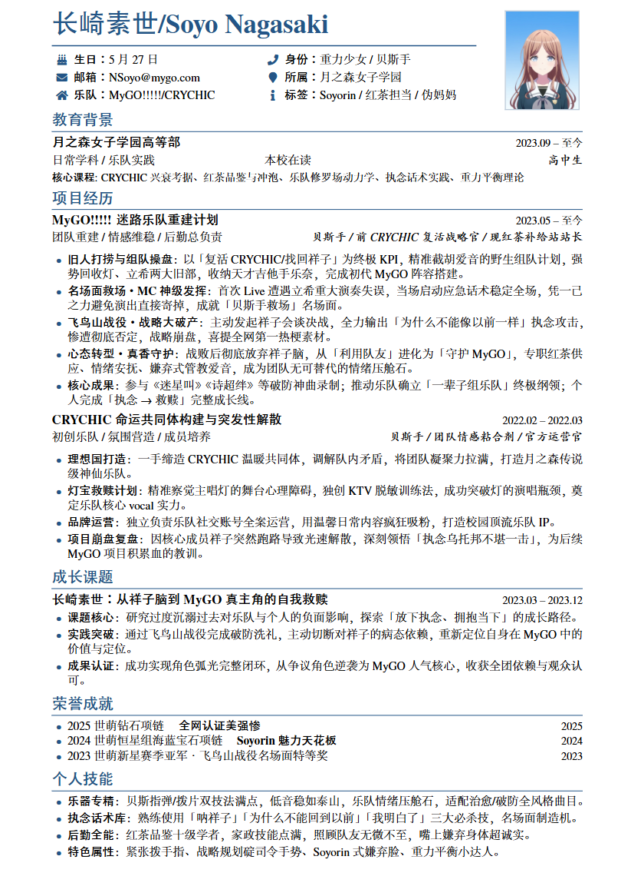

# 简历模板使用与代码指令指南



## 1. 全局样式调校 (`resume.cls`)

通过修改类文件顶部的 `newlength` 变量，可以无需触碰底层代码即可实现全局排版微调。

### 垂直间距指令
| 变量名 | 推荐数值范围 | 逻辑说明 |
| :--- | :--- | :--- |
| `\headergap` | `-1.0ex` 到 `-2.0ex` | **顶部补偿**：抵消页面顶端留白。若内容太多，调小此值（更负）可上提整份简历。 |
| `\sectiontop` | `0.4ex` 到 `1.0ex` | **一级标题上方**：控制模块间的物理距离。 |
| `\sectionbottom`| `0.5ex` 到 `1.0ex` | **下划线下方**：标题横线到正文第一行的距离。 |
| `\itemgap` | `0.1em` 到 `0.3em` | **列表密度**：`itemize` 每一项之间的垂直间距。 |
| `\rulethickness` | `0.5pt` 到 `1.5pt` | **线宽控制**：控制 `\section` 横线和照片边框的粗细。 |

---

## 2. 简历内容编写指令 (`resume.tex`)

### A. 个人信息头部
使用 `\flexibleHeader` 宏，此命令现在可以在tex文件中动态调整个人信息栏的栏目数量及图标和内容。信息列表必须遵循 `图标/标签/内容` 格式，并以逗号分隔。

```latex
\flexibleHeader{姓名/English Name}{
  {\faPhone}/电话/{138-xxxx-xxxx},
  {\faEnvelope}/邮箱/{yourname@email.com},
  {\faBirthdayCake}/生日/{1998.05},
  {\faMapMarker}/籍贯/{广东·广州},
  {\faHome}/现居/{上海·浦东},
  {\faInfo}/其他/{党员 | 随时到岗}
}{images/photo.jpg}
```

### B. 教育背景模块
组合使用 `\datedsubsection` (处理对齐) 与 `\edu` (处理三栏数据)。

```latex
\section{教育背景}
\datedsubsection{大学名称 (排名/性质)}{2021.09 -- 2025.06}
\edu{专业名称}{学院名称 (加权成绩)}{学位/身份}
% 核心课程编写范式
{\small \textbf{核心课程}: 课程A、课程B、课程C、课程D...}
```

### C. 项目经历/工作经历
使用 `\role` 命令定义具体职责，并配合 `itemize` 环境描述细节。

```latex
\section{项目经历}
\datedsubsection{项目名称或公司名称}{2024.01 -- 2024.06} 
\role{你的角色/职位}{技术栈关键词 (如：NLP / PyTorch)}
\begin{itemize}
    \item \textbf{核心技术点}：动词开头 + 描述 + \textbf{量化结果} (如：提升了 15% 效率)。
    \item \textbf{系统设计}：描述使用的架构或算法逻辑。
\end{itemize}
```

### D. 校园经历与荣誉
使用 `\datedline` 实现奖项名与日期的两端对齐。

```latex
\section{荣誉成就}
\begin{itemize}
    \item \datedline{奖项全称 \quad \textbf{获奖等级}}{2024}
    \item \datedline{奖学金名称 \textperiodcentered \ 个人荣誉}{2022}
\end{itemize}
```

---

## 3. 核心命令参数手册

| 命令 | 参数说明 | 视觉效果 |
| :--- | :--- | :--- |
| `\datedsubsection{L}{R}` | `#1`左对齐加粗，`#2`右对齐小号 | 用于：学校、公司、项目名 |
| `\role{R}{L}` | `#2`右对齐斜体，`#1`左对齐正体 | 用于：职位、技术栈标注 |
| `\edu{L}{C}{R}` | 分别占据 38%, 40%, 18% 宽度 | 用于：教育背景详情展示 |
| `\datedline{L}{R}` | 左右对齐的单行文字 | 用于：奖项、校园兼职、短期活动 |

---

## 4. ❕❕❕编译指令与环境要求

1.  **引擎选择**：❕❕❕必须使用 `XeLaTeX` 编译，否则 `fontspec` 和中文字体无法加载。
2.  **字体路径**：
    * 主字体存放于 `./fonts/Main/`。
    * 照片存放于 `./images/`。
3.  **列表控制**：若需进一步压缩空间，可在 `itemize` 之后紧跟 `[leftmargin=1.5em]` 调整缩进。
